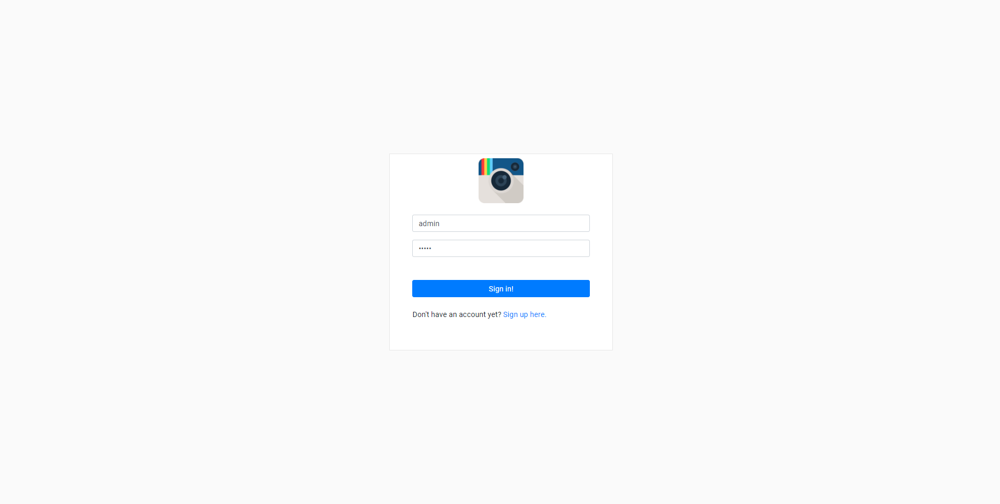
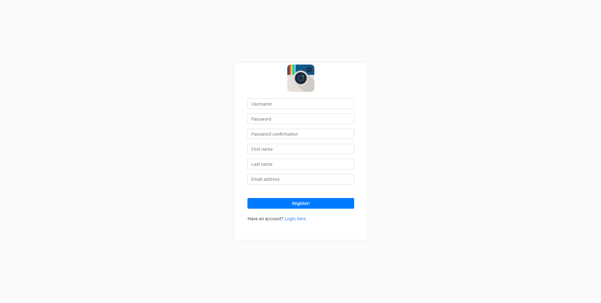
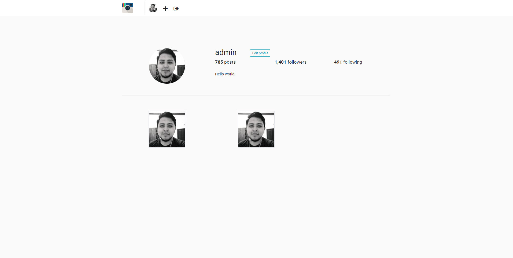
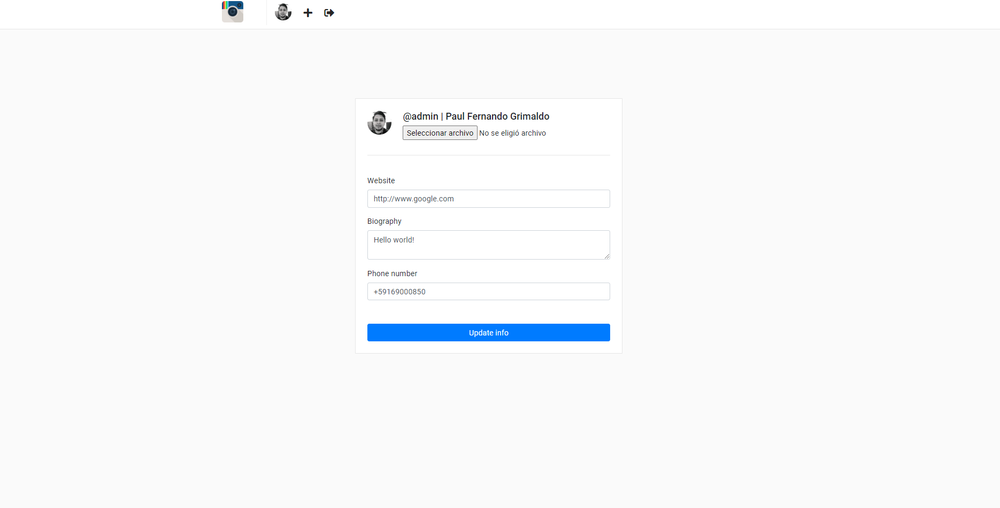
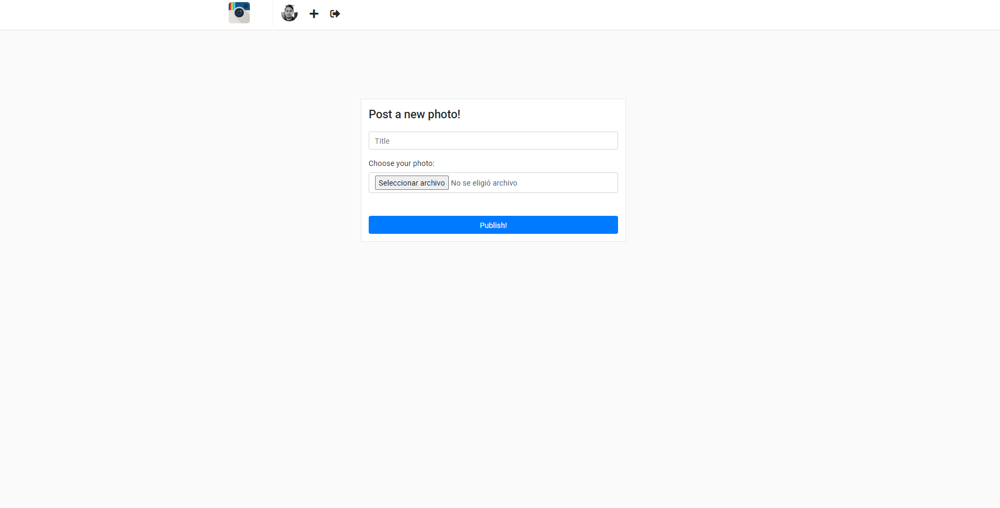

**Instagram example clone** 
    
Install dependencies 
    
        pip install -r requirements.txt
        
Run migrations
        
        python manage.py makemigrations
        python manage.py migrate        

Run app
        
        python manage.py runserver        

**Login Screen**

**Register Screen**

**Feed Screen**

**User Detail Screen** 

**Edit Profile Screen**

**Create Post Screen**

